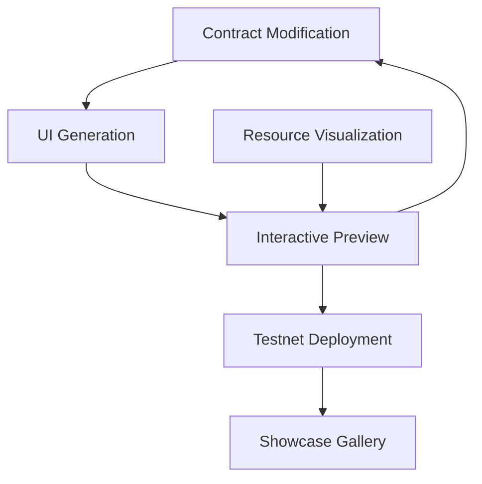

# Apt-ID Interactive Learning Experience
## Implementation Plan for May Hackathon

This document outlines the implementation strategy for embedding Apt-ID as an interactive learning experience for the May hackathon, focusing on a simplified approach where participants can make minor modifications to the existing contract and see immediate UI updates.

## 1. Core Experience Architecture

### Primary Components

1. **Interactive Editor Environment**
   - Split-panel interface showing contract code, generated UI, and blockchain state
   - Simplified Move editor with syntax highlighting and error checking
   - Predefined modification templates for common additions

2. **Real-time UI Generation**
   - Template-based UI components that respond to contract changes
   - Mapping between contract functions and UI elements
   - Styling options with instant preview

3. **Simulation & Visualization**
   - In-browser blockchain simulator for testing
   - Resource group visualization showing storage efficiency
   - Transaction flow animation

4. **Deployment & Sharing**
   - One-click testnet deployment
   - Unique subdomain assignment
   - Showcase gallery for participant creations

## 2. Technical Implementation Strategy

### 2.1 Contract Modification Interface

**Core Framework:**
- Monaco Editor for code editing with Move syntax highlighting
- Focused modification areas highlighted within the existing contract
- Templates for common additions (new link types, profile fields, etc.)

**Guided Experience:**
- Step-by-step tooltips explaining modification options
- Real-time validation with user-friendly error messages
- Limited scope to prevent breaking changes

**Example Modifications:**
- Add a new profile field (e.g., "Skills", "Projects")
- Extend link functionality (e.g., view counters, categories)
- Create custom validation rules

### 2.2 UI Generation System

**Approach:**
- Template-based generation rather than pure AI
- Component library mapped to contract functions
- Configuration options for styling and layout

**Technical Architecture:**
- React component templates for different UI elements
- JSON mapping between contract ABIs and UI components
- CSS variable system for theming

**Implementation Process:**
1. Parse modified contract to extract function signatures and events
2. Map functions to appropriate UI components
3. Apply styling configuration
4. Render preview in real-time

### 2.3 Simulation Environment

**Core Components:**
- WebAssembly-based Move VM for in-browser execution
- Mock blockchain state management
- Transaction simulation with animated data flow

**Visualization Features:**
- B-tree visualization for resource groups
- Cost comparison between traditional and resource group storage
- Transaction lifecycle animation

**User Experience:**
- Instant feedback when executing functions
- Clear visualization of state changes
- Simplified transaction details

### 2.4 Deployment Pipeline

**Deployment Steps:**
1. Validate contract modifications
2. Compile contract for testnet
3. Deploy using project wallet (gas sponsored)
4. Generate frontend with user configurations
5. Deploy to assigned subdomain

**User Flow:**
- Simple form for project details and configuration
- One-click deployment button
- Real-time status updates
- Success screen with project URL and showcase submission option

## 3. Development Roadmap

### Phase 1: Core Editor and Simulation (Week 1-2)
- Implement contract editor with templates
- Create basic UI generation from templates
- Develop in-browser simulation environment

### Phase 2: Visualization and UX (Week 2-3)
- Build resource group visualization
- Implement transaction flow animation
- Refine user experience and add guided tooltips

### Phase 3: Deployment and Gallery (Week 3-4)
- Create deployment pipeline to testnet
- Implement subdomain assignment
- Build showcase gallery for projects

### Phase 4: Testing and Refinement (Week 4-5)
- User testing with target audience
- Performance optimization
- Documentation and learning resources

## 4. Technical Requirements

### Frontend
- React/Next.js framework
- Monaco Editor for code editing
- D3.js for visualizations
- WebAssembly for Move simulation

### Backend
- Next.js API routes for deployment coordination
- Integration with Aptos testnet
- Subdomain management system
- Project database for showcase

### Infrastructure
- Vercel or similar for frontend hosting
- Database for user projects
- CI/CD pipeline for automatic deployment

## 5. Success Metrics

### Primary Metrics
- Number of hackathon participants who complete modifications
- Average time spent in the interactive environment
- Success rate of deployments
- Number of showcase submissions

### Learning Metrics
- Self-reported understanding of key concepts
- Ability to explain resource groups and object model
- Confidence in making future modifications

## 6. Post-Hackathon Expansion

After the May hackathon, the experience can be expanded to include:
- More complex modification options
- AI-generated UI capabilities
- Mainnet deployment options
- Integration with more Aptos features

## 7. Implementation Notes

- Focus on simplicity and reliability for the May hackathon
- Prioritize educational value over technical complexity
- Ensure clear pathways for users with different technical backgrounds
- Provide fallback options if users encounter difficulties

By keeping the initial experience focused on minor modifications with immediate visual feedback, we create an accessible entry point for hackathon participants while still demonstrating the power and flexibility of the Aptos blockchain.