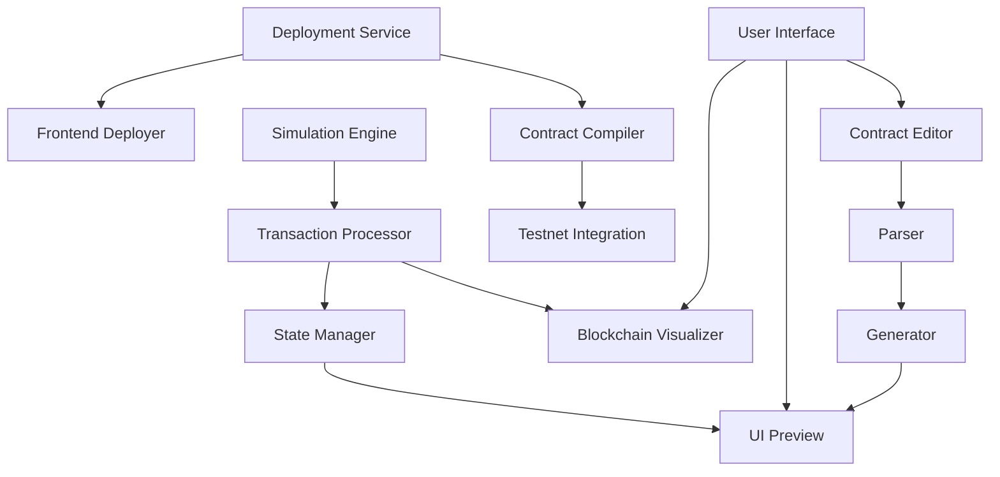

# Apt-ID Interactive Learning Experience
## Technical Specification

This document provides the technical details for implementing the Apt-ID interactive learning experience, focusing on the core components needed for the May hackathon.

## 1. System Architecture



### 1.1 Core Components

| Component | Technology | Purpose |
|-----------|------------|---------|
| UI Shell | Next.js + React | Main application container |
| Contract Editor | Monaco Editor | Move code editing with syntax highlighting |
| UI Preview | React + TailwindCSS | Live preview of generated interface |
| Blockchain Visualizer | D3.js + Canvas | Resource and transaction visualization |
| Simulation Engine | WebAssembly | In-browser Move execution |
| Deployment Service | Next.js API | Testnet deployment coordination |

## 2. Detailed Component Specifications

### 2.1 Contract Editor

#### Features
- Syntax highlighting for Move language
- Error checking and validation
- Template system for common modifications
- Guided tooltips explaining code sections

#### Technical Implementation
- Use Monaco Editor with custom Move language definition
- Create overlay system for tooltips and highlights
- Implement template insertion mechanism
- Add validation layer that checks for common errors

#### Modification Templates
1. **Add Profile Field**
   ```move
   // Example template for adding a new profile field
   // to the Bio struct
   struct Bio has key, copy, drop {
       name: String,
       image_url: String,
       description: String,
       // New field below
       ${field_name}: ${field_type}
   }
   ```

2. **Add Link Type**
   ```move
   // Example template for adding a new link type
   enum Link has store, copy, drop {
       // Existing link types
       UnorderedLink { url: String },
       // New link type below
       ${link_type_name} {
           url: String,
           ${additional_field_name}: ${additional_field_type}
       }
   }
   ```

### 2.2 UI Generation System

#### Features
- Component mapping to contract functions
- Styling configuration
- Responsive preview

#### Technical Implementation
- Create a mapping system between Move functions and React components
- Implement a theme configuration system with CSS variables
- Build a component library for common profile elements

#### Component Mapping Example
```json
{
  "add_links": {
    "component": "LinkEditor",
    "props": {
      "parameters": [
        {"name": "names", "type": "vector<String>", "ui": "input-array"},
        {"name": "links", "type": "vector<String>", "ui": "input-array"}
      ],
      "styling": {
        "layout": "vertical",
        "submitButton": "Add Links"
      }
    }
  }
}
```

### 2.3 Simulation Engine

#### Features
- In-browser Move execution
- Transaction simulation
- State management

#### Technical Implementation
- Create a simplified Move VM in WebAssembly
- Implement state storage and transaction processing
- Build visualization connectors for the UI

#### Key Interfaces
```typescript
interface SimulationEngine {
  executeTransaction(txPayload: TransactionPayload): Promise<TransactionResult>;
  getResourceState(address: string, resource: string): Promise<ResourceState>;
  visualizeResourceGroup(address: string, group: string): ResourceVisualization;
}

interface TransactionResult {
  success: boolean;
  gasUsed: number;
  changedResources: ResourceChange[];
  events: Event[];
  error?: string;
}
```

### 2.4 Resource Visualization

#### Features
- B-tree visualization for resource groups
- Interactive exploration of resources
- Cost comparison metrics

#### Technical Implementation
- D3.js for tree visualization
- Canvas for performance with large data structures
- Custom rendering for Aptos-specific resource types

#### Visualization Types
1. **Resource Group B-Tree**
   - Show hierarchical structure
   - Highlight resource relationships
   - Provide zoom and exploration

2. **Storage Efficiency Comparison**
   - Side-by-side visualization of traditional vs. resource group storage
   - Cost metrics for each approach
   - Visual indication of savings

3. **Transaction Flow**
   - Animated path of transaction through system
   - State changes highlighted
   - Event emissions shown

### 2.5 Deployment Pipeline

#### Features
- One-click testnet deployment
- Subdomain assignment
- Status tracking

#### Technical Implementation
- Next.js API routes for deployment coordination
- Integration with Aptos CLI via server-side execution
- Frontend deployment to Vercel or similar

#### Deployment Process
1. Validate contract modifications
2. Compile contract using Aptos CLI
3. Deploy contract to testnet using project wallet
4. Generate frontend with configuration
5. Deploy frontend to assigned subdomain
6. Register in showcase database

#### API Endpoints
```
POST /api/deploy/validate
POST /api/deploy/contract
POST /api/deploy/frontend
GET /api/deploy/status/:deploymentId
GET /api/showcase/list
POST /api/showcase/submit
```

## 3. Data Models

### 3.1 User Project
```typescript
interface UserProject {
  id: string;
  name: string;
  description: string;
  contractModifications: ContractModification[];
  uiConfiguration: UIConfig;
  deploymentStatus: DeploymentStatus;
  deploymentUrl?: string;
  createdAt: Date;
  updatedAt: Date;
}

interface ContractModification {
  templateId: string;
  parameters: Record<string, any>;
  code: string;
}

interface UIConfig {
  theme: {
    primaryColor: string;
    secondaryColor: string;
    textColor: string;
    backgroundColor: string;
  };
  layout: 'default' | 'compact' | 'expanded';
  components: ComponentConfig[];
}

enum DeploymentStatus {
  NOT_DEPLOYED = 'not_deployed',
  VALIDATING = 'validating',
  COMPILING = 'compiling',
  DEPLOYING_CONTRACT = 'deploying_contract',
  DEPLOYING_FRONTEND = 'deploying_frontend',
  COMPLETE = 'complete',
  FAILED = 'failed'
}
```

### 3.2 Showcase Entry
```typescript
interface ShowcaseEntry {
  id: string;
  projectId: string;
  title: string;
  description: string;
  screenshotUrl: string;
  deploymentUrl: string;
  features: string[];
  authorName: string;
  authorContact?: string;
  submittedAt: Date;
  approved: boolean;
}
```

## 4. Development Environment

### 4.1 Setup Requirements
- Node.js 18+
- Aptos CLI
- WebAssembly toolchain
- Next.js development environment

### 4.2 Development Server
```bash
# Install dependencies
npm install

# Run development server
npm run dev

# Build WebAssembly components
npm run build:wasm

# Run tests
npm test
```

### 4.3 Environment Variables
```
# Aptos configuration
APTOS_NODE_URL=https://fullnode.testnet.aptoslabs.com/v1
APTOS_FAUCET_URL=https://faucet.testnet.aptoslabs.com
APTOS_PROFILE_ADDRESS=0xaea5b834a6bcab2de9556051c200bd1dbc2f0c70f4eafced96f05ca0ff9af6dc

# Deployment configuration
DEPLOYMENT_WALLET_PRIVATE_KEY=  # For gas sponsorship
VERCEL_TOKEN=  # For frontend deployment
DOMAIN_SUFFIX=learn.aptoslabs.com  # For subdomain assignment
```

## 5. Integration Points

### 5.1 Aptos Learn Platform Integration
- Embed experience via iframe or direct component integration
- Pass authentication context for user identification
- Handle navigation between Learn modules

### 5.2 Aptos Blockchain Integration
- Connect to testnet nodes for deployment
- Use gas station for sponsored transactions
- Handle Aptos error responses and status codes

### 5.3 Showcase Gallery Integration
- Submit completed projects to central gallery
- Display projects with filtering and sorting
- Allow voting and commenting

## 6. Performance Considerations

### 6.1 Optimization Targets
- Initial load time: < 3 seconds
- Code editor response time: < 100ms
- UI generation time: < 500ms
- Transaction simulation: < 1 second

### 6.2 Resource Requirements
- Browser: Modern browser with WebAssembly support
- Memory: 4GB+ recommended
- Network: Stable connection for deployment

### 6.3 Optimizations
- Lazy load components not needed for initial render
- Use Web Workers for heavy computation
- Implement caching for compilation results
- Pre-compile common templates

## 7. Security Considerations

### 7.1 Code Execution Sandboxing
- Execute all user code in isolated environments
- Implement timeouts for computation
- Validate all user inputs

### 7.2 Deployment Security
- Use server-side API keys for deployment
- Validate all contract code before deployment
- Implement rate limiting on deployment endpoints

### 7.3 User Data Protection
- Store minimal user data required
- Use secure authorization methods
- Clear sensitive data when sessions end

## 8. Testing Strategy

### 8.1 Unit Tests
- Component rendering tests
- Parser functionality tests
- Simulation engine tests

### 8.2 Integration Tests
- End-to-end workflow tests
- Deployment pipeline tests
- UI generation from templates

### 8.3 User Testing
- Controlled testing with target audience
- Usability assessment
- Feedback collection

## 9. Implementation Timeline

| Phase | Duration | Key Deliverables |
|-------|----------|------------------|
| Setup & Architecture | 1 week | Project structure, core components |
| Editor & Parser | 1 week | Contract editor, template system |
| UI Generation | 1 week | Component mapping, preview system |
| Simulation | 1 week | In-browser execution, visualization |
| Deployment | 1 week | Testnet deployment, showcase integration |
| Testing & Refinement | 1 week | Bug fixes, performance optimization |

## 10. Future Extensions

Post-hackathon, the system can be extended to include:
- Full AI-based UI generation
- More complex contract modifications
- Mainnet deployment options
- Integration with Aptos Build
- Multi-user collaboration features
- Expanded visualization capabilities

This technical specification provides a comprehensive blueprint for implementing the Apt-ID interactive learning experience, with a focus on delivering a simplified yet powerful environment for the May hackathon.