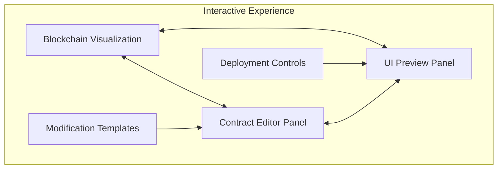
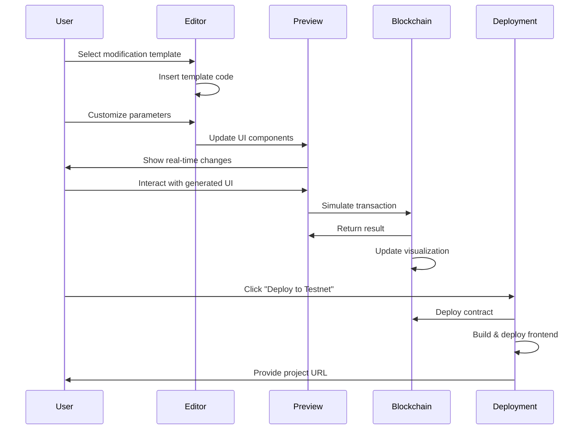
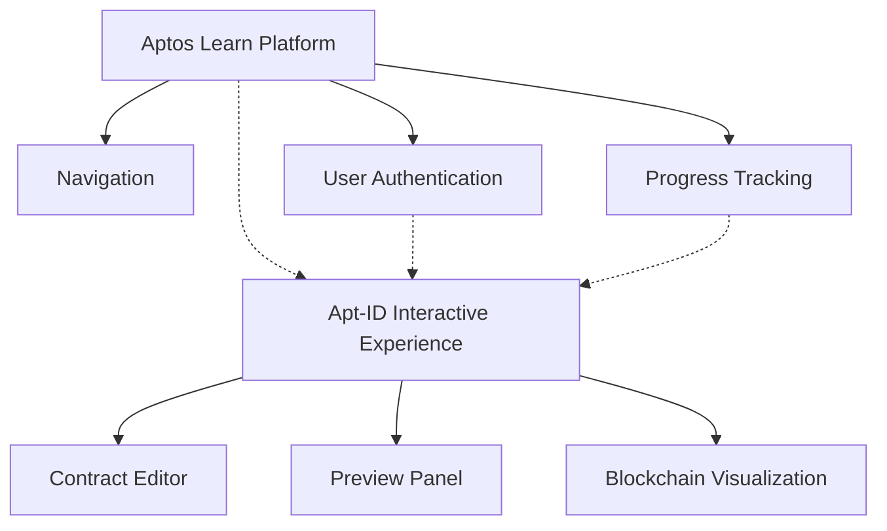
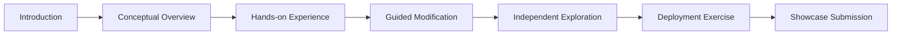

# Apt-ID Interactive Learning Experience
## Visual Concept & User Journey

This document provides visual mockups and user journey maps to illustrate how the Apt-ID interactive learning experience would function from a participant's perspective at the May hackathon.

## 1. User Interface Concept

### 1.1 Main Interface Layout

```
+---------------------------------------------------------------+
|                     APTOS LEARN HEADER                        |
+---------------------------------------------------------------+
|                                                               |
| +---------------------------+ +-----------------------------+ |
| |                           | |                             | |
| |                           | |                             | |
| |    CONTRACT EDITOR        | |      PREVIEW PANEL          | |
| |                           | |                             | |
| |                           | |                             | |
| |                           | |                             | |
| +---------------------------+ +-----------------------------+ |
|                                                               |
| +---------------------------------------------------------------+
| |                  BLOCKCHAIN VISUALIZATION                    | |
| +---------------------------------------------------------------+
|                                                                 |
| +-----------------------+ +-----------------------------------+ |
| |  MODIFICATION GUIDES  | |       DEPLOYMENT CONTROLS         | |
| +-----------------------+ +-----------------------------------+ |
|                                                                 |
+----------------------------------------------------------------+
```

### 1.2 Interactive Split-Panel Interface



## 2. User Journey Map

### 2.1 Core User Flow



### 2.2 Learning Sequence

1. **Discover** - Explore the base Apt-ID application
2. **Understand** - Review contract code and UI relationship
3. **Modify** - Make changes to the contract with templates
4. **Visualize** - See how changes affect blockchain storage
5. **Deploy** - Push changes to testnet
6. **Share** - Submit to showcase gallery

## 3. Visual Mockups

### 3.1 Contract Editor with Templates

```
+----------------------------------------------------------------+
| CONTRACT EDITOR                                  [ Monaco ]    |
+----------------------------------------------------------------+
| // Apt-ID Profile Contract                                     |
| module profile_address::profile {                              |
|                                                                |
|     // Highlighted modification area                           |
|     ┌──────────────────────────────────────────────────┐      |
|     │ struct Bio has key, copy, drop {                 │      |
|     │     name: String,                                │      |
|     │     image_url: String,                           │      |
|     │     description: String                          │      |
|     │     // Add your custom field below               │      |
|     │     skills: vector<String>                       │      |
|     │ }                                                │      |
|     └──────────────────────────────────────────────────┘      |
|                                                                |
| +----------------+ +---------------+ +--------------------+    |
| | + Add Field    | | + Add Link    | | + Add Function     |    |
| +----------------+ +---------------+ +--------------------+    |
|                                                                |
+----------------------------------------------------------------+
```

### 3.2 Preview Panel with Generated UI

```
+----------------------------------------------------------------+
| PREVIEW PANEL                                                  |
+----------------------------------------------------------------+
|                                                                |
|     ┌──────────────────────────────────────────────────┐      |
|     │                      ╭───╮                       │      |
|     │                      │ 🧑 │                       │      |
|     │                      ╰───╯                       │      |
|     │                                                  │      |
|     │             Hackathon Participant               │      |
|     │                                                  │      |
|     │       Building awesome projects on Aptos!        │      |
|     │                                                  │      |
|     │  +------------+  +------------+  +------------+  │      |
|     │  │  GitHub    │  │  Twitter   │  │  Portfolio │  │      |
|     │  +------------+  +------------+  +------------+  │      |
|     │                                                  │      |
|     │  ┌─────────────────────────────────────────┐    │      |
|     │  │ Skills                                  │    │      |
|     │  │ • Move Programming                      │    │      |
|     │  │ • Frontend Development                  │    │      |
|     │  │ • Blockchain Architecture               │    │      |
|     │  └─────────────────────────────────────────┘    │      |
|     │                                                  │      |
|     └──────────────────────────────────────────────────┘      |
|                                                                |
+----------------------------------------------------------------+
```

### 3.3 Resource Visualization

```
+----------------------------------------------------------------+
| BLOCKCHAIN VISUALIZATION                                       |
+----------------------------------------------------------------+
|                                                                |
|      RESOURCE STORAGE EFFICIENCY                               |
|                                                                |
|  Traditional Storage    vs    Resource Group Storage           |
|                                                                |
|  ┌────┐ ┌────┐ ┌────┐         ┌────────────────────┐          |
|  │Bio │ │Link│ │Ref │         │     ObjectGroup    │          |
|  └────┘ └────┘ └────┘         │  ┌───┐ ┌───┐ ┌───┐ │          |
|    |      |      |            │  │Bio│ │Link│ │Ref│ │          |
|    v      v      v            │  └───┘ └───┘ └───┘ │          |
|  ┌────┐ ┌────┐ ┌────┐         └────────────────────┘          |
|  │Slot│ │Slot│ │Slot│                   |                      |
|  └────┘ └────┘ └────┘                   v                      |
|                                       ┌────┐                   |
|                                       │Slot│                   |
|                                       └────┘                   |
|                                                                |
|  Storage Cost: 0.0034 APT       Storage Cost: 0.0012 APT      |
|                                                                |
|  [Toggle View]  [Show Transaction Flow]  [Reset Visualization] |
|                                                                |
+----------------------------------------------------------------+
```

### 3.4 Deployment Panel

```
+----------------------------------------------------------------+
| DEPLOYMENT CONTROLS                                           |
+----------------------------------------------------------------+
|                                                                |
|  Project Name: [My Apt-ID Profile                        ]    |
|                                                                |
|  Subdomain:    [my-profile.learn.aptoslabs.com           ]    |
|                                                                |
|  ┌────────────────────────────────────────────────────┐       |
|  │ Theme Customization                                │       |
|  │ Primary Color:   [#6F4BD5]   Secondary: [#45CAFF]  │       |
|  └────────────────────────────────────────────────────┘       |
|                                                                |
|  [  Test in Simulation  ]      [  Deploy to Testnet  ]        |
|                                                                |
|  ┌────────────────────────────────────────────────────┐       |
|  │ Deployment Status:                                 │       |
|  │ ○ Not Started                                      │       |
|  │ ○ Compiling Contract                               │       |
|  │ ○ Deploying Contract                               │       |
|  │ ○ Building Frontend                                │       |
|  │ ○ Complete                                         │       |
|  └────────────────────────────────────────────────────┘       |
|                                                                |
+----------------------------------------------------------------+
```

## 4. Interaction Highlights

### 4.1 Adding a New Profile Field

When a user selects "Add Field" from the template options:

1. The editor highlights the Bio struct
2. A dropdown appears with field type options (String, vector<String>, u64, etc.)
3. The user enters a field name and selects a type
4. The code updates with the new field
5. The preview panel automatically shows a new section for this field
6. The resource visualization updates to show the modified structure

### 4.2 Testing a Profile Interaction

When a user clicks on a generated UI element in the preview:

1. The action triggers a simulated transaction
2. The transaction appears in the blockchain visualization
3. The visualization animates the data flow
4. Resource changes are highlighted
5. Gas costs and storage efficiency are displayed
6. The preview updates to reflect the new state

### 4.3 Deploying to Testnet

When a user clicks "Deploy to Testnet":

1. The deployment panel shows validation progress
2. Contract compilation status updates in real-time
3. Deployment transaction details appear in the blockchain panel
4. Frontend build progress is displayed
5. When complete, a link to the deployed application appears
6. An option to submit to the showcase gallery is presented

## 5. Educational Overlay System

Throughout the experience, contextual tooltips and guided hints appear:

```
+----------------------------------------------------------------+
|                                                                |
|  ┌──────────────────────────────────────────────────────┐     |
|  │ 🔍 Resource Groups                                   │     |
|  │                                                      │     |
|  │ This visualization shows how Aptos resource groups   │     |
|  │ store multiple resources in a single storage slot,   │     |
|  │ making your application more gas-efficient.          │     |
|  │                                                      │     |
|  │ Learn more: [Resource Groups Documentation]          │     |
|  └──────────────────────────────────────────────────────┘     |
|                                                                |
+----------------------------------------------------------------+
```

## 6. Mobile-Friendly View

For participants using tablets or smaller screens:

```
+----------------------------------------------------------------+
| APTOS LEARN HEADER                                            |
+----------------------------------------------------------------+
| [EDITOR] [PREVIEW] [BLOCKCHAIN] [DEPLOY] <-- Tab Navigation   |
+----------------------------------------------------------------+
|                                                                |
|   Currently viewing: PREVIEW                                   |
|                                                                |
|   +--------------------------------------------------+        |
|   |                                                  |        |
|   |                 ACTIVE PANEL                     |        |
|   |                                                  |        |
|   |                                                  |        |
|   |                                                  |        |
|   |                                                  |        |
|   |                                                  |        |
|   +--------------------------------------------------+        |
|                                                                |
|   [Previous Step]                [Next Step]                   |
|                                                                |
+----------------------------------------------------------------+
```

## 7. Experience Integration

### 7.1 Learn Platform Embedding



### 7.2 Workshop Flow Integration



## 8. Success Indicators

Visual indicators are presented throughout the experience to help users track their progress:

```
+----------------------------------------------------------------+
| LEARNING PROGRESS                                              |
+----------------------------------------------------------------+
|                                                                |
|  [✓] Explore base application                                  |
|  [✓] View contract structure                                   |
|  [✓] Add custom profile field                                  |
|  [✓] Add custom link type                                      |
|  [ ] Deploy to testnet                                         |
|  [ ] Submit to showcase                                        |
|                                                                |
|  Progress: ███████████████████████░░░░░ 75%                    |
|                                                                |
+----------------------------------------------------------------+
```

This visual concept document illustrates how the Apt-ID interactive learning experience would appear and function from a user perspective, providing a clear vision for implementation and stakeholder alignment.